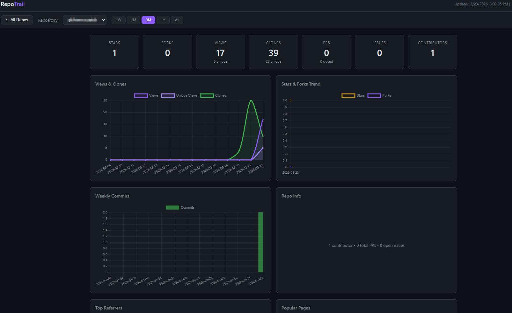

# RepoTrail

Self-hosted dashboard that tracks GitHub repository metrics over time. GitHub only retains traffic data (views, clones, referrers, popular paths) for 14 days -- RepoTrail fetches and stores it permanently so you never lose historical insights.



## Features

- **Traffic persistence** -- accumulates views, clones, referrers, and popular paths beyond GitHub's 14-day window
- **Per-repo dashboards** -- stars, forks, PRs, issues, contributors, with interactive charts
- **Background sync** -- fetches metrics on a configurable interval (default: every 6 hours)
- **Manual refresh** -- trigger a fetch from the UI with a single click
- **Public/private toggle** -- filter which repos to display and fetch
- **Rate-limit aware** -- monitors GitHub API quota and skips non-essential requests when low
- **Single-file frontend** -- dark theme SPA with Chart.js, no build step required

## Quick Start

### Docker (recommended)

```bash
git clone https://github.com/NormlT/repotrail.git
cd repotrail
cp .env.example .env
# Edit .env -- set GITHUB_TOKEN and GITHUB_OWNER
docker compose up --build -d
```

Open `http://localhost:8055` in your browser.

### Local development

```bash
cp .env.example .env
# Edit .env -- set GITHUB_TOKEN and GITHUB_OWNER
bash dev.sh
```

Creates a virtual environment, installs dependencies, and starts uvicorn with hot-reload on port 8055. Use `bash dev.sh --reset` to recreate the venv.

## Configuration

All settings are read from a `.env` file (or environment variables).

| Variable | Required | Default | Description |
|----------|----------|---------|-------------|
| `GITHUB_TOKEN` | Yes | -- | GitHub PAT with `repo` scope |
| `GITHUB_OWNER` | Yes | -- | GitHub user or org to track (filters repos by owner) |
| `API_KEY` | No | -- | Bearer token to protect the dashboard. If set, all `/api/` requests require `Authorization: Bearer <key>` header |
| `FETCH_INTERVAL_HOURS` | No | `6` | Hours between automatic fetches |
| `PORT` | No | `8055` | Server port |
| `DB_PATH` | No | `./data/repotrail.db` | SQLite database path |

### GitHub token

Create a [personal access token](https://github.com/settings/tokens) (classic) with the `repo` scope. Traffic endpoints require push access to the repository -- repos you don't have push access to will have their traffic data gracefully skipped.

## How It Works

1. On startup (and every `FETCH_INTERVAL_HOURS`), RepoTrail discovers repos accessible to your token that belong to `GITHUB_OWNER`
2. For each repo it fetches: traffic views/clones, referrers, popular paths, PR counts, contributor counts
3. Data is upserted into a local SQLite database -- daily traffic rows accumulate over time
4. The frontend queries the API and renders charts for any selectable time period (1 week to all-time)

### Architecture

```
app/
  main.py            # FastAPI app, background fetch orchestrator, API routes
  config.py          # Pydantic settings (.env)
  database.py        # SQLite schema, upserts, queries (7 tables)
  github_client.py   # GitHub API client with rate limiting and pagination
  static/index.html  # Entire frontend SPA (vanilla JS + Chart.js)
```

## API

| Method | Path | Description |
|--------|------|-------------|
| GET | `/api/repos` | List repos. `?include_private=true\|false` |
| GET | `/api/repos/{repo}/stats` | Repo stats. `?period=1w\|1m\|3m\|1y\|all` |
| GET | `/api/repos/{repo}/referrers` | Top referrers for a repo |
| GET | `/api/repos/{repo}/paths` | Popular pages for a repo |
| POST | `/api/refresh` | Trigger manual fetch. `?include_private=true\|false` |
| GET | `/api/status` | Fetch status and rate limit info |

## Docker management

Rebuild after code changes:

```bash
docker compose down && docker compose up --build -d
```

Wipe all cached data and start fresh:

```bash
docker compose down -v
docker compose up --build -d
```

## License

[MIT](LICENSE)
